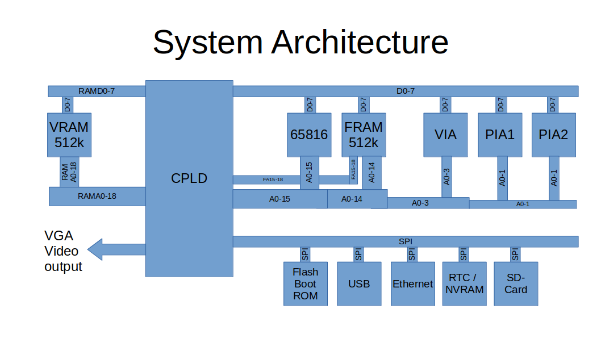

# FPGA code for the MicroPET 3.x, Ultra-CPU 2.x, and Ulti-PET 1.x

The three boards from the title use a Spartan 6 FPGA, that is programmed with the 
VHDL code from this repository.

All three boards use the same basic architecture based on the [Ultra-CPU](), which
contains the CPU, RAM, FPGA, video output, etc, and uses I/O via the CS/A bus.
The [Micro-PET]() uses this and integrates the standard PET I/O onto a single PCB.
The [Ulti-PET]() further integrates additional CS/A boards, and adds more functionality 
on top. See the linked pages for more information.

In these boards the FPGA sits between the 65816 CPU and the Video (Media) RAM. In addition to 
the video RAM access it provides the timing and memory mapping and controls select signals
for RAM directly connected to the CPU, a CS/A bus, and/or specific select signals
for PET I/O chips. Also, it provides a DMA engine for DAC audio output, and an
SPI interface for various other devices.

The FPGA uses the video RAM
to create a VGA video output with 768x576 resolution at 60 Hz. When the CPU 
tries to access this memory, it is halted by stretching Phi2 until there is no 
access needed for video output or DAC DMA.

## Overview

The programmable logic implements a number of features that are addressable in the I/O area 
at $e8xx. In addition, there are standard locations for I/O that is provided by the
Ulti-PET board, or available as add-on-cards to the Ultra-CPU's CS/A bus.

The address ranges marked with "BUS" are routed to the CS/A bus connector and activated
by using the /IOSEL bus line. Either the boards on the CS/A bus or the Ulti-PET board
then decode the addresses further. The two PIAs and the VIA get their own select lines from
the FPGA in the Micro-PET though.

This is an overview on the address ranges and FPGA register set:

- $e800-$e807: System control ports (built-in, see below)
- $e808-$e80b: [SPI interface](SPI.md), built-in to the FPGA
- $e80c-$e80f: BUS: I2C interface 
- $e810-$e813: BUS: PET PIA 1 (directly in the Micro-PET)
- $e818-$e81f: BUS: UART 1 for RS232
- $e820-$e823: BUS: PET PIA 2 (directly in the Micro-PET)
- $e828-$e82f: BUS: UART 2 for TTL serial / UEXT serial
- $e830-$e83f: [DAC audio interface](DAC.md), built-in to the FPGA
- $e840-$e84f: BUS: PET VIA  (directly in the Micro-PET)
- $e850-$e85f: BUS: VIA for (Fast) IEC and 5V SPI
- $e860-$e87f: BUS: DUAL SID Board SID 1 
- $e880-$e8df: [Video interface](VIDEO.md) or [below](#crtc-emulation) (built-in to the FPGA; 96 bytes when memory-mapped)
- $e8e0-$e8ff: BUS: DUAL SID Board SID 2

The assumed default boards used are 
- [PETIO](http://www.6502.org/users/andre/csa/petio/index.html): provides all the PET I/O with the two PIAs and the VIA
- [DUALSID](http://www.6502.org/users/andre/csa/dualsid/index.html): provides up to two SID sound devices
- [IEC/UART](http://www.6502.org/users/andre/csa/iecuart/index.html): provides the second VIA for 5V SPI, and (fast) serial IEC bus

In addition, if enabled, the PET 8296 control port is available:

- $fff0 (65520)  [8296 memory control (8296 memory map only)](#8296-control-port)

## System Control Ports

This is an overview on the register set:

- $e800 (59392)  [Video control](#e800-59392-video-control)
- $e801 (59393)  [Memory map control](#e801-59393-memory-map-control)
- $e802 (59394)  [Low32k bank](#e802-59394-low32k-bank)
- $e803 (59395)  [Speed control](#e803-59395-speed-control)
- $e804 (59396)  [bus window](#e804-59396-bus-window)
- $e805 (59397)  [video window map](#e805-59397-video-window)

### $e800 (59392) Video Control

- Bit 0: unused - must be 0
- Bit 1: 0= 40 column display, 1= 80 column display
- Bit 2: 0= screen character memory in bank 0, 1= character memory only in video bank (see memory map)
- Bit 3: unused - must be 0
- Bit 4: unused - must be 0
- Bit 5: unused - must be 0
- Bit 6: unused - must be 0
- Bit 7: 0= video enabled; 1= video disabled

Note that if you use 80 columns, AND double pixel rows (+interlace), you get the 80x50 character resolution.
This mode is, however, not easily manageable by normal code in bank 0. In the $8xxx area the video
and colour memory can be accessed. The first half accesses the character video memory, the second half
is reserved for the colour memory. Now, 80x50 character require almost 4k of character video memory,
almost twice as much as is available in the reserved space from $8000 to $8800. So, the screen can,
in this mode, only be managed using long addresses into bank 8 (the video bank), or code running
in the video bank.

Note that the 40/80 column switch is only there for Micro-PET 2.x compatibility, that is using a CPLD with very 
restricted video output capabilities. In the newer versions 40/80 columns should be set in the [Viccy](VIDEO.md) registers.

#### Screen mirror in bank 0

The CRTC reads its video data from the video bank in VRAM.
This is not mapped to bank 0 in the CPU address space, as it is "slow" memory, because
the available memory bandwidth is shared with the video access.

To allow the PET code to directly write to $8xxx for character video memory, Bit 2 maps
the $8xxx window in CPU bank 0 to the VRAM video bank.

Note that with the register $e805, the position of the video window in the video bank
can be changed (while it stays at $8xxx in the CPU memory bank 0). This allows 
for easy switching between multiple screens beyond the 4k limit of the PET video memory
window at $8xxx.

#### Interlace and 50 row mode

After reset, the VGA video circuit runs in normal mode,
i.e. only every second raster line is displayed with video data.
Writing a "1" into Viccy register 8, bit 1, interlace is switched on, and every
single line is displayed with video data. 

As long as Viccy r8 bit 0 is 0, every rasterline is 
displayed twice, to get to the same height as in interlace mode.
If r8 bit 0 is 1, then every rasterline is a new rasterline.
So, setting bit 0=1 and bit 1=1 gives double the number of character rows
(or raster rows in bitmap mode). I.e. with this you can enable 50 character row
screens.

See the [Viccy registers](VIDEO.md) for more details.

### $e801 (59393) Memory Map Control

- Bit 0: 0= allow cross-bank access in emulation mode, 1= lock CPU into bank 0 in emulation mode
- Bit 1: 0= normal mode, 1= initial boot mode, swap FRAM and VRAM (see above)
- Bit 2: unused, must be 0
- Bit 3: 0= 8296 mode is disabled / locked ($fff0 disabled); 1= 8296 control port $fff0 enabled
- Bit 4: 0= $009xxx is writable, 1= write protected
- Bit 5: 0= $00Axxx is writable, 1= write protected
- Bit 6: 0= $00Bxxx is writable, 1= write protected
- Bit 7: 0= $00C000-$00FFFF is writable, 1=write protected (except I/O window at $e8xx)

### $e802 (59394) Bank Control

- Bit 0-3: number of 32k bank in 512k Fast RAM (banks 0-7), for the lowest 32k of system
- Bit 4-7: unused, must be 0

This allows re-mapping the lower 32k of bank 0, i.e. including stack and zeropage/direct page
areas between multiple locations in fast RAM.

### $e803 (59395) Speed Control

- Bit 0/1: speed mode
  - 00 = 1 MHz
  - 01 = 2 MHz
  - 10 = 4 MHz
  - 11 = 12.5 MHz with wait states for video access to VRAM
- Bit 2-7: unused, must be 0

### $e804 (59396) Bus window

The board uses all CPU banks between and including 0 and F, i.e. 1 MByte of RAM.
The 1 MB CS/A bus is actually mapped into the CPU address space as banks $10-$1F, so
all the memory is accessible.

To allow to use some boards that have space in bank 0 on the CS/A bus that should be used
in bank 0 of the CPU, two windows of the CS/A bus can be mapped into bank 0 of the CPU:

- Bit 0: map $9xxx of the CS/A bus into $9xxx of CPU bank 0
- Bit 1: map $Cxxx of the CS/A bus into $Cxxx of CPU bank 0
- Bit 2: if bit 0=1, when set, maps $9xxx to CS/A I/O instead of memory
- Bit 3: n/a (if bit 1=1, when set, maps $cxxx to CS/A I/O instead of memory)
- Bit 4-7: unused, must be 0

### $e805 (59397) Video window

- Bit 0-2: number of 2k character video memory block the $80xx-$87ff window points to; possible addresses in VRAM bank 0 (CPU bank 8) are:
  - $80xx 
  - $88xx
  - $90xx
  - $98xx
  - $a0xx
  - $a8xx
  - $b0xx
  - $b8xx
- Bit 3-7: unused, must be 0

Note that the colour RAM window at $8800-$8fff maps correspondingly to start at 
  - $c0xx
  - $c8xx
  - ...
  - $f8xx

### 8296 control port

This write only control port at $fff0 (65520) enables the RAM mapping in the upper 32k of bank 0, as implemented
in the 8296 machine. The address of this port is $FFF0.
To enable it, bit 3 in the Memory Map Control register must be set.

- Bit 0: 0= write enable in $8000-$bfff, 1= write protected
- Bit 1: 0= write enable in $c000-$ffff, 1= write protected
- Bit 2: select one of two block to map for $8000-$bfff (starts either $010000 or $018000)
- Bit 3: select one of two block to map for $c000-$ffff (starts either $014000 or $01c000)
- Bit 4: - unused, must be 0 -
- Bit 5: 0= RAM in $8xxx, 1= screen peek-through the mapped RAM
- Bit 6: 0= RAM in $e8xx, 1= I/O peek-through the mapped RAM
- Bit 7: 0= RAM mapping disabled, 1=enabled

## CRTC emulation

The *Viccy* Video code (partially) emulates a subset of the CRTC registers - but adds a lot of more registers and functionality on top.

After reset, as usual with the CRTC, you have to write the register number to index register $e880 (59520),
the write the value to write to the register to $e881 (59521).
Viccy provides a way to read the index register, and auto-increment the index register on access to the data registers.
Also, the 96 Viccy registers can be mapped into I/O memory.

See the [Viccy](VIDEO.md) description for more details.

## Memory Map

The memory map looks as follows. There are 512k "Fast" RAM
that make up banks 0-7, and 512k "Video" RAM that make up banks 8-15.

### Standard Map

This map describes the standard memory map, that is enabled after the
SPI boot code has executed and initiated the memory map.

RAM bank 8 is the "video" bank in that hires graphics and character ROMs 
are mapped here. The character data is be mapped there as well but can be
mapped for writing to bank 0 using bit 2
of the control register (see below).

RAM bank 1 is the one used for the 8296 RAM extension (that is mapped into the
upper 32k of bank 0 when the 8296 control register at $fff0 is set.

    Video   +----+ $100000
    RAM     |    |         VRAM 
            |    |         bank 15 
            +----+ $0f0000
            |    |
             ...
            |    |
            +----+ $090000
            |    |         VRAM
            |    |	   bank 8 (video)
            +----+ $080000
    Fast    |    |         FRAM
    RAM     |    |         bank 7
            +----+ $070000
            |    |
             ...
            |    |
            +----+ $020000
            |    |         FRAM
            |    |         bank 1 (8296 mapped memory)
            +----+ $010000
            |    |         FRAM (PET ROM / I/O / 4k Video mapped from VRAM) $8000-$ffff
            |    |         FRAM (lower 32k)
            +----+ $000000

### Init Map

When the CPU boots, it tries to do so from bank 0. Here we have RAM, so we have to provide some 
initial mapping.

The problem here is that the CPU boots from bank 0, but the CPLD can only
write to Video RAM. So, the boot code from the SPI Flash can only be written
into Video RAM to boot the CPU. Therefore, a bit in the control register
switches the two RAM areas. On hardware reset the Video RAM is mapped to 
banks 0-7 and Fast RAM to banks 8-15. 

The first thing the boot code does is to copy itself to Fast RAM, and
switch over the two RAM chips.

### Video Map

#### Character memory

The following diagram describes the way that the character video memory is addressed.

             Video    +----+ $090000
             BANK     |    |        
                      |    |	 
                      |    |	 
                      +----+ $08e000	 
     CPU              |    |	 
     Bank 0           |    |
       |              |    |	 
       |              +----+ $08c000
       |      /---->  |    |	BCtrl 4/5 -> 11 / CRTC12 -> $30
     $9000    |       +----+ $08b000
       | -----+---->  |    |	BCtrl 4/5 -> 10 / CRTC12 -> $20
     $8000    |       +----+ $08a000
       |      |\--->  |    |	BCtrl 4/5 -> 01 / CRTC12 -> $10
       |      |       +----+ $089000
       |      \---->  |    |	BCtrl 4/5 -> 00 / CRTC12 -> $00
       |              +----+ $088000
       |              |    |	 
                      |    |	 
                      |    |	 
                      +----+ $088000	 
                      |    |	 
                      |    |	 
                      |    |	 
                      +----+ $086000	 
                      |    |	 
                      |    |	 
                      |    |	 
                      +----+ $084000	 
                      |    |	 
                      |    |	 
                      |    |	 
                      +----+ $082000	 
                      |    |	 
                      |    |	 
                      |    |	 
                      +----+ $080000

       
Using the Bank control register, the $8xxx window in bank 0 (if enabled via Video control
register), maps to one of four 4k blocks in the video RAM. 
The four blocks start at $088000, $08a000, $08b000, and $08c000 repectively.

At the same time CRTC register 12 can be used to fetch the video data from 
any of the blocks starting at 1k boundaries from $088000 ... $08cc00.

This way one character video block can be mapped to CPU bank 0, while the CRTC
fetches its video output data from another video output block.
This can be used to implement double buffering, or even multiple virtual
"machines" 

#### Character generator memory

The following diagram describes the way that the char generator memory is addressed.
The Character generator memory is the memory that holds the pixel data for each character.
Each character has 16 consecutive bytes, so that the maximum of 9 pixel rows per
character can be handled. As a character has 16 bytes, a character set of 256 characters
has a character generator of 4k.

The Bank Control register allows to select 4 blocks of 8k for the character generator memory,
located at the lower half of the Video Bank 8.
In each 8k, there are two sets of character generators, of 4k each. The one to use is selected by the
VIA CA2 output pin as on the PET.

       Video    +----+ $090000
       BANK     |    |        
                |    |	 
                |    |	 
                +----+ $08e000	 
                |    |	 
                |    |
                |    |	 
                +----+ $08c000
                |    |
                |    |
                |    |
                +----+ $08a000
                |    |	 
                |    |
                |    |	 
                +----+ $088000	 
                |    |	      CRTC12.6/7 -> 11, VIA CA2=1 
                +----+ $087000	 
                |    |	      CRTC12.6/7 -> 11, VIA CA2=0 
                +----+ $086000	 
                |    |	      CRTC12.6/7 -> 10, VIA CA2=1 
                +----+ $085000	 
                |    |	      CRTC12.6/7 -> 10, VIA CA2=0
                +----+ $084000	 
                |    |	      CRTC12.6/7 -> 01, VIA CA2=1
                +----+ $083000	 
                |    |	      CRTC12.6/7 -> 01, VIA CA2=0
                +----+ $082000	 
                |    |	      CRTC12.6/7 -> 00, VIA CA2=1
                +----+ $081000	 
                |    |	      CRTC12.6/7 -> 00, VIA CA2=0
                +----+ $080000
        

## Code

The code contains three modules:

- VideoColorVGA.vhd: the video controller part
-- VideoVGACanvas70m.vhd: general VGA timing
-- VideoBorder.vhd: horizontal border
-- VideoVBorder.vhd: vertical border
-- Sprite.vhd: sprite code
- ClockVGA17M.vhd: clock generation
- MapperPET.vhd: memory mapping
- Top.vhd: glue logic and timing
- Spi.vhd: SPI module
- DAC.vhd: DAC module
- ShellUltra.vhd: outermost module for the Ultra-CPU and Ulti-PET
- ShellUPet.vhd: outermost module for the Micro-PET

- pinoutSpartan14a.ucf: Pinout definition for Ultra-CPU and Ulti-PET
- pinoutUPet30b.ucf: Pinout definition for the Micro-PET

## Build

The VHDL code is compiled using the latest version of WebISE that still supports the Spartan 6 chips, i.e. version 14.7.
It can still be downloaded from the Xilinx website.

Note that you need to create separate builds for the Micro-PET on one side, and the Ultra-CPU and Ulti-PET on the other side
due to their minimally different pinout definitions and I/O select outputs.

For more information on the setup, see the [build file](Build.md).

